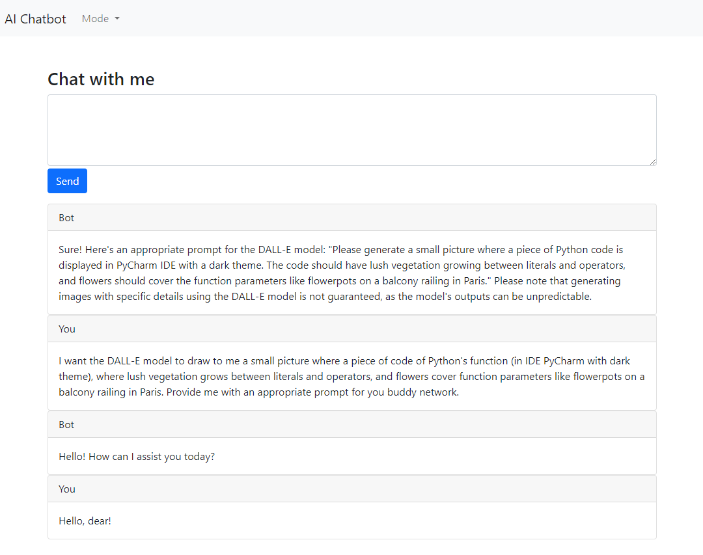
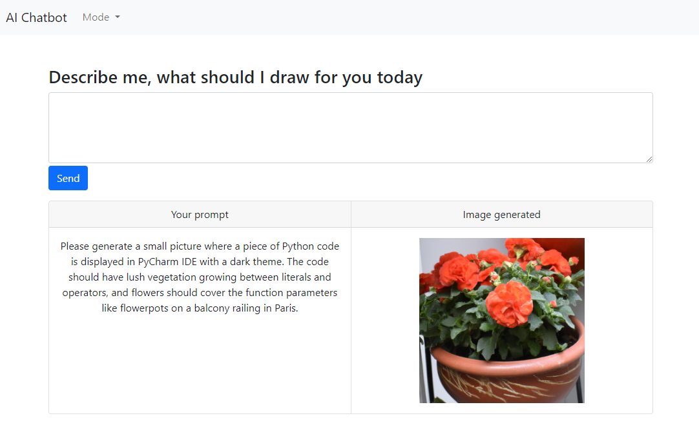

# fast-api-ai-bot-aws
AWS (Lambda)-deployed Fast API Bot with AI support.

The project offers a full-fledged web application - a chat bot and an image-generation-bot, built on FastAPI, with integration with OpenAI ChatGPT and DALL-E models through OpenAI API. The project is intended to be deployed on AWS using Lambda. The project was made as part of a training course "The Complete Chatbot Bootcamp (OpenAI, GPT, FastAPI & AWS)" on Udemy (https://www.udemy.com/course/the-complete-chatbot-bootcamp).

Oh, yes. You should know that chatbot initializes with a system prompt of "You are a Python developer", and as such, the responses might be appropriately biased :-)





## On OpenAI API Key
To run the app you'll need to create `.env` file in project's root (where `main.py` lives), and store there a key which authenticates you for OpenAI API services. See https://platform.openai.com/account/api-keys. Read instructions there carefully. Note, that you'll might need to pay for the usage, so keep the code safe!

Like this:
`OPENAI_API_KEY=<your key here>`


## Run locally
```uvicorn main:app --reload```

## Manual deploy to AWS
### Create deployment zip
1. Create dependencies directory: `pip install --upgrade -t dependencies -r requirements.txt`
2. Create zip with dependencies, templates and main.py: `cd dependencies & zip ../aws_lambda_artifact.zip -r . & cd .. & zip aws_lambda_artifact.zip -u templates/* main.py`


### Configure lambda function in AWS
1. Create new lambda function
2. Upload .zip
3. In Runtime settings set Python 3.10 and Handler as `main.handler`
4. Enable public Function URL
5. Set OPENAI_API_KEY in Environment variables
6. Pay attention to time-out configuration, as the default timeout is only 3 seconds: `Edit basic settings > Timeout`
